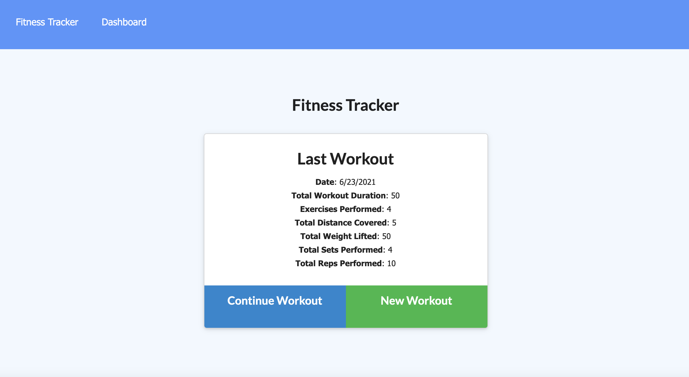
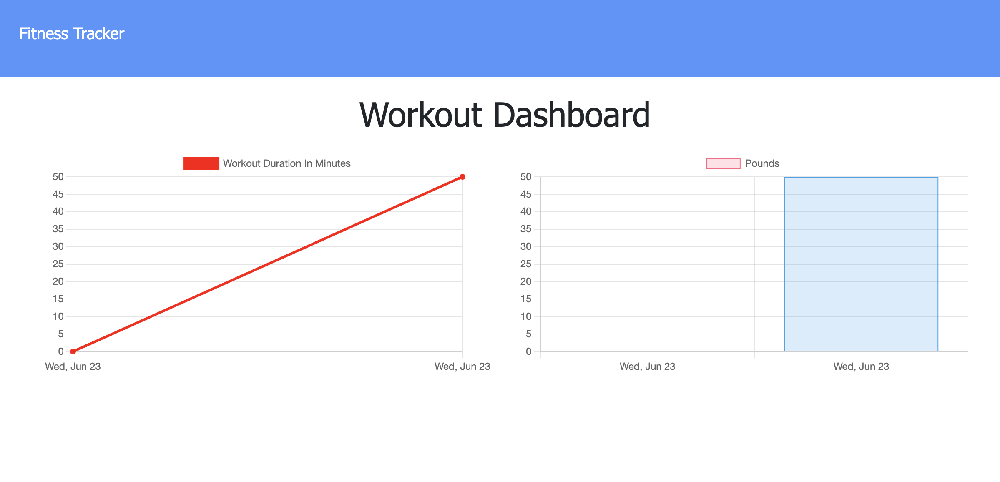

# 18-Nosql-Workout-Tracker

# Table of Contents

1. [Description](#Description)
2. [Features](#Features)
3. [Installation](#installation)
3. [License](#License)
4. [Contributing](#Contributing)
5. [Questions](#Questions)
6. [Screenshot](#screenshot)

# Description 

My task was to create a fitness app that allows the user to view, create and track daily workouts. The user is able to log multiple exercises in a workout on a given day. The user is able to track the name, type, weight, sets, reps, and duration of exercise. If the exercise is a cardio exercise, the user is able to track the distance traveled.

# Features
- NodeJS
- MongoDB
- Nosql

# License

## This application is covered by the MIT license. 

# Contributing
Contributions are excepted. Fill free to fork. 

# Questions
## GitHub User name 
ashleykohladler

### Link to GitHub:
https://github.com/ashleykohladler/18-Nosql-Workout-Tracker

### Link to Heroku:
https://blooming-stream-28780.herokuapp.com/

### Email address 
ashleykohladler@gmail.com

### Screenshot

 
 
